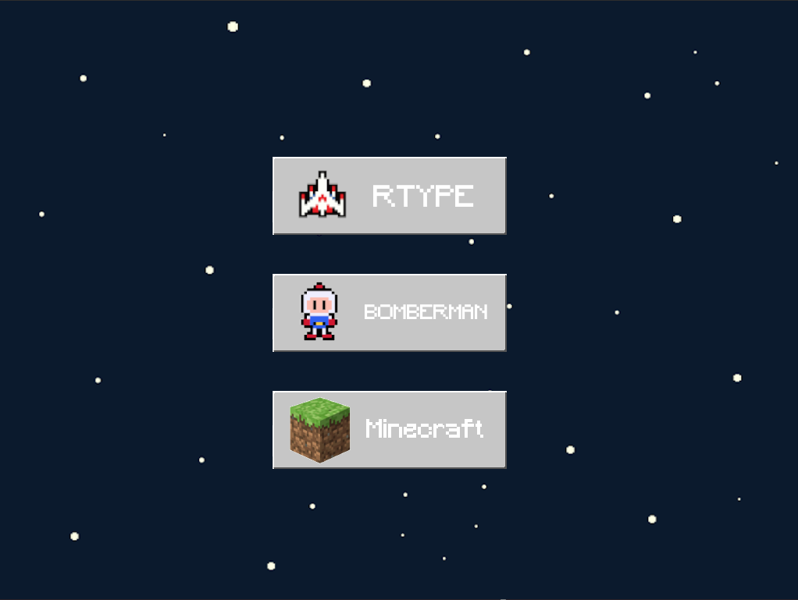
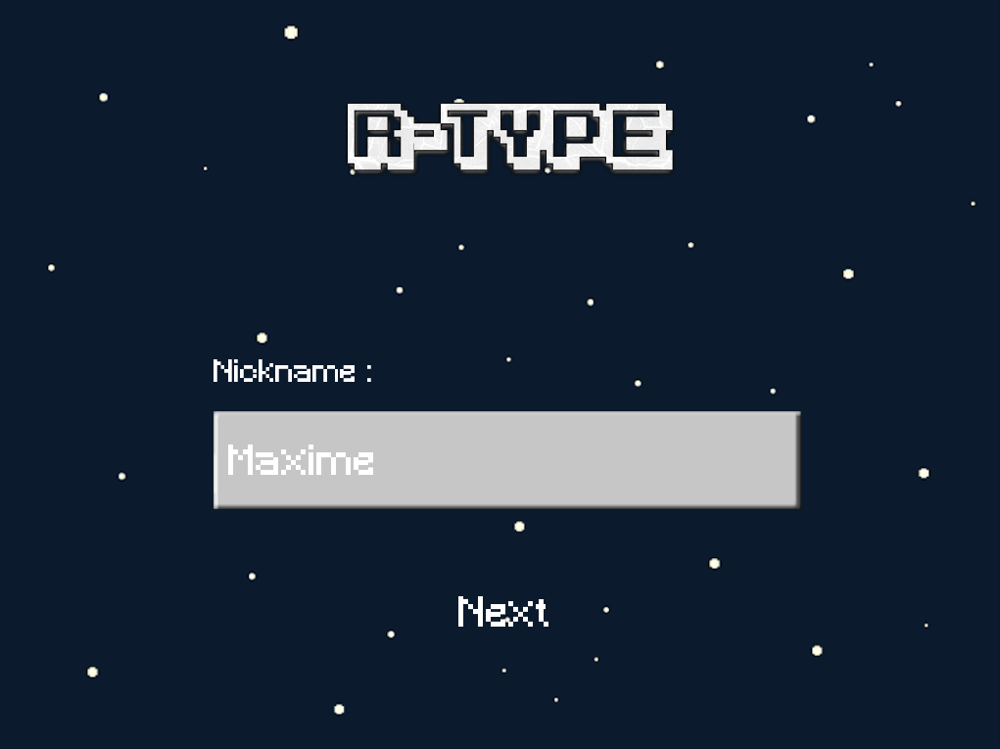
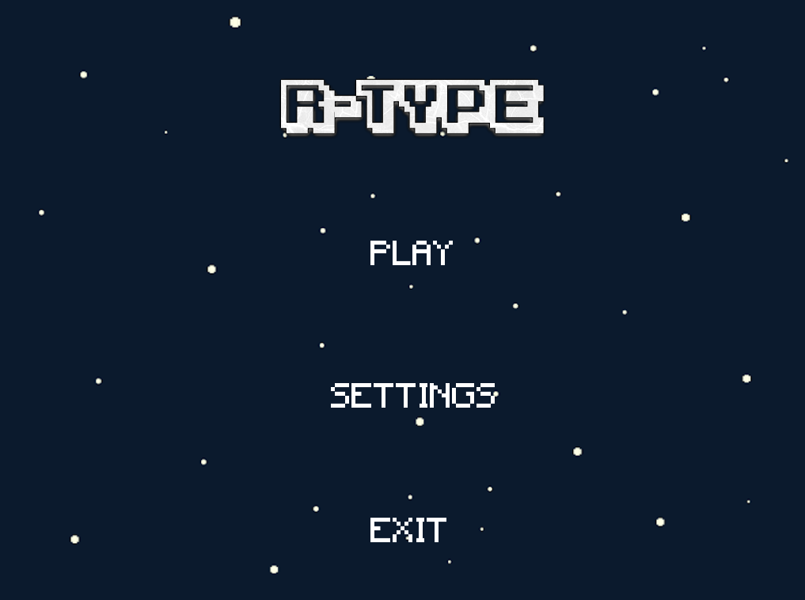
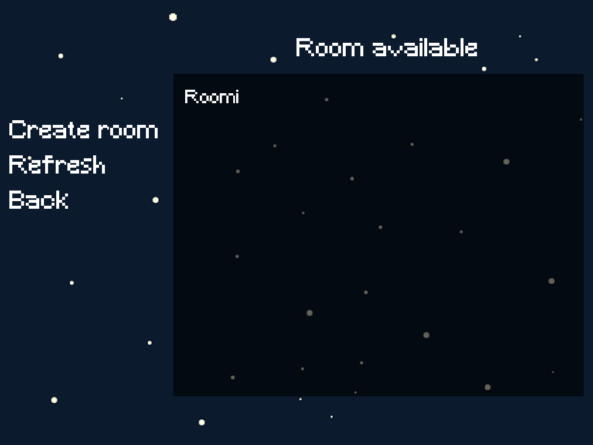
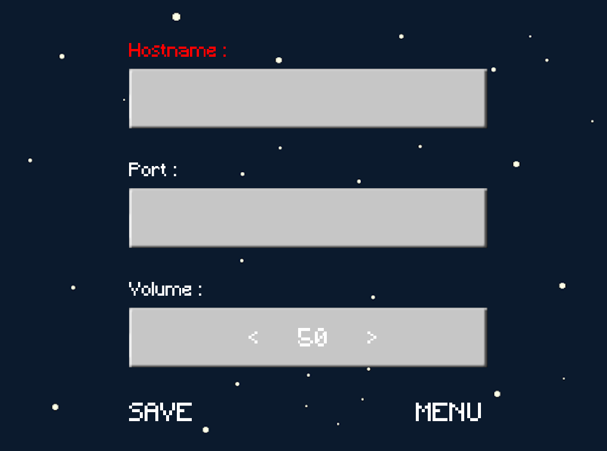
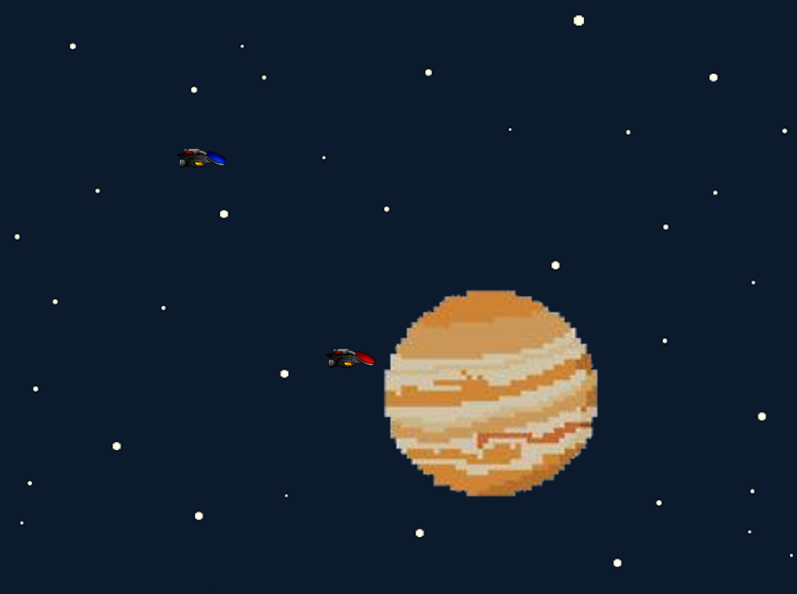

## **Readme R-TYPE**

### This README list global project features.

*R-TYPE is Epitech project  
4 novembre to 1 décembre 2019  
Made by - Hugo CASTELLI, Pierre HERMAN, Constant LOUBIER and Maxime NOURRIGAT*  
  
**Project description :**  
  
As you now understand, you have to make your own version of R-Type. The purpose of this project is to create a one-to-four player game, using a client/server architecture. This is important. It MUSTbe a client/server architecture. Peer-to-peer communication is not allowed.

**Librairies:**
	- Boost
	- SFML
	- Conan

**Bonus Features**

 - Spectator player
 - Server signal intensity

**Screenshots**
	- Begin Interface 
	
	- Nickname Interface 
	
	- Menu Interface 
	
	- Play Interface 
	
	- Settings Interface 
	
	- Game interface 
	